# TermiGraph_esp

  

Repositorio en español para el código de TermiGraph.

Índice:

1. [Sobre TermiGraph](https://github.com/proyectoTeresIA/TermiGraph_esp/edit/main/README.md#sobre-termigraph)
1. [Flujo de la conversión](https://github.com/proyectoTeresIA/TermiGraph_esp/edit/main/README.md#flujo-de-la-conversi%C3%B3n)

## Sobre TermiGraph

TermiGraph es un servicio de conversión que consta de cinco módulos, los cuales dependen del formato:

1. **Glosarios monolingües:** listas de términos, los cuales se han de separar con un salto de línea. Los ficheros deben ser texto plano (_.txt_)
2. **Terminologías TBX-Basic:** terminologías en formato TBX-Basic (_.tbx_) con el estilo DCT
3. **XML (TERMCAT):** terminologías en XML (_.xml_) que siguen la estructura definida por TERMCAT
4. **JSON (IATE):** recursos JSON (_.json_) que siguen la estructura definida por IATE
5. **Excell (UNTerm):** terminologías en hoja de cálculos Excel (_.xlsx_) basado en la estructura de UNTerm

**Próximamente:** guía para el usuario con la documentación sobre cada estructura

## Flujo de la conversión

1. **Preprocesado:** cada recurso presenta carácteristicas únicas, tanto de estructura como de contenido, y a menudo la información contenida en el recurso se ha de atomizar o separar. Por ejemplo, la información relativa a la categoría gramatical, el género y el número se presenta en bloque, mientras que en RDF cada elemento se representa mediante una propiedad distinta. Asimismo, durante este proceso, se trata de normalizar la representación de los idiomas mediante el uso de Lexvo. En ocasiones, también se generan formas como 'profesor' y 'profesora' a partir de 'profesor -a'.
2. **Generación de mapeos:** para establecer las correspondencias entre los datos preprocesados y las ontologías, se requiere un fichero de mapeo que contiene las reglas a seguir. Este fichero se crea mediante Mapeathor, una herramienta de generación de reglas basada en spreedcheets (hojas de cálculo). Esta herramienta facilita la generación de los mapeos ya que reduce el nivel de conocimiento técnico necesario.
3. **Transformación a RDF:** teniendo en cuenta tanto el fichero de mapeos como los datos preprocesados, los datos son finalmente transformados a RDF mediante la herramienta RMLMapper 
